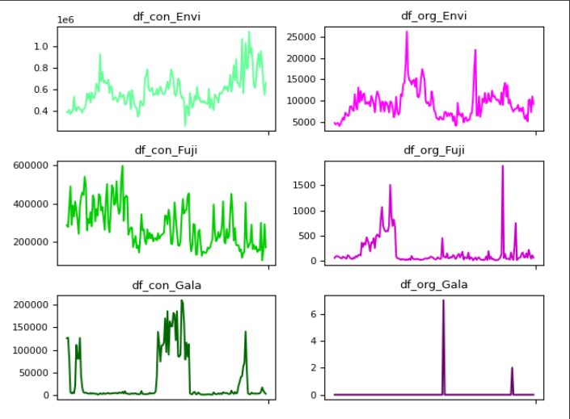
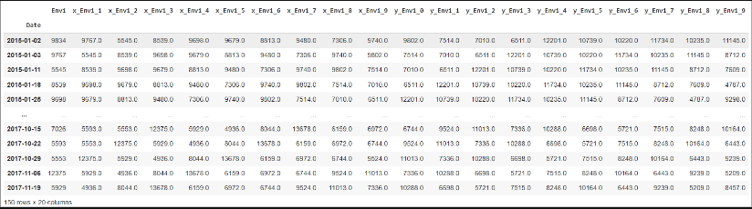

# Intro

## Dataset

    ข้อมูลการส่งออกแอปเปิ้ล 3 สายพันธ์ ตามประเภทของแอปเปิ้ล ในประเทศเนเธอร์แลนด์
    จากปี ค.ศ.2015 - 2019 มีจำนวนข้อมูลทั้งหมด 338 ข้อมูล 
    เป็นประเภท Organic และ Convetional จำนวนละ 169 ข้อมูล

## สายพันธ์ Apple
    * Envi Organic และ Conventional
    * Fuji Organic และ Conventional
    * Gala Organic และ Conventional

## Graph

    กราฟแสดงค่าของข้อมูลการส่งออกของ Apple ที่แบ่งออกมาแต่ละสายพันธ์และประเภท

    * กราฟทุกอันยกเว้น Organic Fuji Conventional Gala และ Organic Gala มีการกระจายตัวของข้อมูลที่ดี

    * Organic Fuji และ Conventional Gala มีค่าสูงเฉพาะบางช่วง

    * Organic Gala ค่าต่ำเป็น 0 แทบทั้งหมด

# Preparing Data

## รูปแบบการเตรียม

### จัดเตรียมแบบรายวัน (มีการกระจายตัวของข้อมูลที่ดี)

    * Organic Fuji 
    * Conventional Gala
    * Organic Gala 

### จัดเตรียมแบบเดือนและไตรมาส (มีค่าสูงเฉพาะบางช่วง)

    * Organic Fuji 
    * Conventional Gala

### จัดเตรียมโดยการปรับค่าเป็น 1 (มีค่าต่ำเป็น 0 แทบทั้งหมด)

    * Organic Gala

## การสร้าง Sequence

    เป็นการแบ่งข้อมูลออกเป็น 2 ส่วน คือ ข้อมูลอดีต และ ข้อมูลเฉลย
    ทำเพื่อให้สามารถ Train เป็นช่วงเวลาได้

 

ยกตัวอย่างเช่น Input = 10 Output = 7 

    ข้อมูลอดีต 10 ข้อมูล ข้อมูลเฉลย 7 ข้อมูล

 

## การเตรียมของ Organic Fuji และ Conventional Gala

### รูปแบบเดือน (Train-Test 8:2)

    * ข้อมูลอดีต 24 ข้อมูล (Input)
    * ข้อมูลเฉลย 6 ข้อมูล (Output)

### รูปแบบไตรมาส (Train-Test 8:2)

    * ข้อมูลอดีต 8 ข้อมูล (Input)
    * ข้อมูลเฉลย 4 ข้อมูล (Output)

## การเตรียมของ Organic Gala

    เปลี่ยน 0 เป็น 1

## ขั้นตอนการสร้าง Model

### Linear Regression

    เป็นวิธีการทางสถิติที่ใช้หาความสัมพันธ์ระหว่างตัวแปรสองตัว 

โดยใช้เส้นตรงเป็นตัวแทนความสัมพันธ์นั้น โดยตัวแปรทั้งสองตัวนี้คือ

    * ตัวแปรอิสระ (ตัวแปรที่วัดค่าได้) 
    * ตัวแปรตาม (ต้องการคาดการณ์) 

**ข้อดี**

    * เข้าใจง่ายและเหมาะสำหรับการวิเคราะห์ความสัมพันธ์เชิงเส้นระหว่างตัวแปรสองตัว 

**ข้อเสีย**

    * ไม่สามารถอธิบายความสัมพันธ์ที่ซับซ้อนระหว่างตัวแปรได้และอ่อนไหวต่อ outliers

 

### Decision Tree

    เป็นอัลกอริทึมที่ใช้โครงสร้างคล้ายต้นไม้ที่มีการแบ่งแยกข้อมูลตามเงื่อนไขต่างๆ ไปจนถึงผลลัพธ์

**ข้อดี**

    * ง่ายต่อการเข้าใจ: โครงสร้างของ Decision Tree คล้ายกับการตัดสินใจของมนุษย์ ทำให้เข้าใจได้ง่าย

    * สามารถทำงานได้กับข้อมูลหลากหลายประเภท: ทั้งข้อมูลเชิงตัวเลขและเชิงหมวดหมู่

    * สามารถระบุความสัมพันธ์ที่ไม่ใช่เชิงเส้น: เหมาะกับข้อมูลที่มีความสัมพันธ์ซับซ้อน

**ข้อเสีย**

    * Overfitting: Decision Tree มีแนวโน้มที่จะ overfit กับข้อมูล training set 
      -> หมายความว่าโมเดลเรียนรู้รายละเอียดของข้อมูล training set มากเกินไปจนไม่สามารถ generalize ไปยังข้อมูลใหม่ได้

    * Underfitting: Decision Tree มีแนวโน้มที่จะ underfit กับข้อมูล training set 
      -> หมายความว่าโมเดลไม่เรียนรู้ข้อมูล training set เพียงพอ ส่งผลให้โมเดลมีประสิทธิภาพต่ำ

    * ความไวต่อ outliers: Outliers เป็นข้อมูลที่มีค่าผิดปกติ ส่งผลต่อ Decision Tree มากกว่าโมเดลประเภทอื่น

 

### Gradient Boosting

    เป็นอัลกอริทึมที่ใช้ในการสร้างโมเดลทางสถิติสำหรับงาน Classification และ Regression 
    โดยมีความสามารถในการปรับปรุงโมเดลไปเรื่อยๆ จนกระทั่งได้ผลลัพธ์ที่ดีขึ้น
    ตาม gradient descent ของฟังก์ชันความคลาดเคลื่อน (loss function) 

**ข้อดี**

    * จัดการกับข้อมูลที่มีความซับซ้อนได้ดี และมีประสิทธิภาพในการทำนายที่สูง

**ข้อเสีย**

    * ความช้าในการทำงานและความซับซ้อนของการปรับแต่งพารามิเตอร์ที่จำเป็นสำหรับการตั้งค่าโมเดลให้มีประสิทธิภาพสูงสุด

 

### Elastic Net Regression

    รวมเอาลักษณะทั้งของ Ridge และ Lasso โดยใช้ค่าผลต่างของทั้งสองในการปรับน้ำหนักของตัวแปรต้น 

**ข้อดี**

    * ลด Overfitting

    * ควบคุมตัวแปรที่มีความสำคัญและไม่สำคัญต่อการทำนาย

**ข้อเสีย**

    * ต้องปรับค่า hyperparameter อย่างถูกต้องเพื่อให้ได้ผลลัพธ์ที่ดี
        
    * การอธิบายหรืออธิบายผลลัพธ์ของ Elastic Net อาจทำให้ซับซ้อนเมื่อมีการใช้ alpha ที่ผสม Ridge และ Lasso penalties

 

### Stacking Ensamble

    เป็นเทคนิคหนึ่งในการสร้างโมเดลแบบอิงจากกลุ่ม (ensemble learning) 
    โดยที่เราใช้โมเดลหลายตัวมา "สะสม" (stack) 
    ผลลัพธ์จากโมเดลแต่ละตัวเพื่อทำนายผลลัพธ์ที่ดีขึ้น

**ข้อดี**

    * ช่วยเพิ่มประสิทธิภาพของการทำนายได้มากขึ้นเมื่อเทียบกับการใช้โมเดลเดียวเพียงอย่างเดียว

    * ลดความผิดพลาดของโมเดลการเรียนรู้และทำให้การทำนายมีประสิทธิภาพมากขึ้นด้วยการรวมผลลัพธ์
      จากโมเดลหลายตัวที่มีความแตกต่างกันอย่างมีประสิทธิภาพและทำให้โมเดลสามารถให้ผลลัพธ์ที่มีความแม่นยำมากยิ่งขึ้นได้

**ข้อเสีย**

    * ใช้เวลาในการประมวลผลนาน

    * ความซับซ้อนของการทำงาน

 

### Random Forest

    เป็นอัลกอริทึม Machine Learning ประเภท Ensemble Learning ที่ใช้ Decision Tree หลาย ๆ ต้น
    มาประกอบกันเพื่อทำนายผลลัพธ์ จะมีแบ่งข้อมูลเป็นหลายๆชุด และข้อมูลแต่ละชุดนำไปสร้างต้นไม้
    แล้วทำนายผลลัพธ์จาก Decision tree ทุกต้นโดยใช้ majority vote

**ข้อดี**

    * ลดค่า correlation ระหว่าง Tree ได้

**ข้อเสีย**

    * มีค่า bias อยู่ ซึ่งแก้โดยเพิ่ม depth ของ Tree

**ประเภทของข้อมูลที่ทำให้ random forest ทำนายผลลัพธ์ออกมาได้แย่**

    * ข้อมูลที่มี noise มาก

    * ข้อมูลที่มีความไม่สมดุล (Imbalanced data):
      การเรียนรู้ class น้อยน้อย: 
      Random Forest อาจจะเรียนรู้ class น้อย น้อยกว่า class มาก

    * ข้อมูลที่มี outliers มาก: การบิดเบือนค่าเฉลี่ย: Outliers อาจจะดึงค่าเฉลี่ยของข้อมูลไปทางตัวเอง

## ค่า MAPE

    เป็นวิธีวัดความแม่นยำ โดยคำนวณเปอร์เซ็นต์ความผิดพลาดในการพยากรณ์ค่าที่ได้ต่ำจะมีความแม่นยำสูง

## ค่า Graph

    วัดโดยเทียบเส้นการทำนายของโมเดลต่าง ๆ กับเส้น Actual

# Conclude
    * Sequence data
    * Hyper Parameter
    * ข้อมูลดี/ไม่ดี (มีความ Variance มากยิ่งดี)
    * Train Test Size

### Envi apples (Organic)

    * จากผลลัพธ์ของแต่ละ model กับข้อมูลนี้ที่ข้อมูลไม่ได้มีความผิดปกติมาก จึงทำให้ประสิทธิภาพของ model เป็นที่น่าพึ่งพอใจ

    * ใช้ algorithm ที่มีความซับซ้อนอย่างเช่น stacking ensemble และ gradient boosting 
      ที่มีการ train ด้วยการหา hyperparameter ที่ดีที่สุดและ crossvalidation

    * model ที่ดีที่สุดของการทดลองนี้คือ stacking และ gradient boosting

### Envi apples (Conventional)

    * ประเทศ เนเธอร์แลนด์ ส่งออก Apples Envi ประเภท Conventional มากที่สุดเมื่อเทียบกับสายพันธุ์และประเภทอื่นๆ

    * ในช่วงปีท้ายๆ มีการส่งออกเป็นจำนวนมาก

    * บางช่วงส่งออกน้อยลงแต่มากกว่าในบางช่วงของสายพันธุ์และประเภทอื่น

    * model ที่ดีที่สุดของการทดลองนี้คือ Linear Regression และ Elastic net

### Gala apples (Organic)

    * ประเทศ เนเธอร์แลนด์ เเทบจะไม่ส่งออก Apples  gala ที่เป็น organic เลย

    * มีส่งออกเเค่ 2 ครั้ง (7 เเละ 3)จาก 169 ครั้ง

    * decision tree เเละ random forest  จะดีที่สุดเพราะเป็นเส้นตรงที่ขนานเเกน x อยู่ที่ 0

    * ค่า MAPE เเละ ค่า R2 ของ linear จะดีกว่า เเต่ในกราฟจะมีทำนายเป็นโค้งขึ้นไปจาก 0

### Gala apples (Conventional)

    * ประเทศ เนเธอร์แลนด์ มีการส่ง Gala Apple แบบ Conventional ที่ขึ้นอยู่กับฤดูกาล

    * มีช่วงที่ส่งออกเยอะและช่วงที่แทบจะไม่มีการส่งออกเลย

    * ทำเป็นแบบเดือนและไตรมาส

    * Gradient Boosting ดีที่สุดในแบบเดือน

    * Linear ดีที่สุดในแบบไตรมาส    (แต่อาจเกิดการ Overfitting)

### Fuji apples (Organic)

    * ประเทศ เนเธอร์แลนด์ มีการส่ง Apples fuji ที่เป็น organic
      ที่ขึ้นอยู่กับฤดูกาลจะมีช่วงที่ส่งออกมากๆและถ้าไม่อยู่ในช่วงนั้นก็จะมีการส่งออกที่ค่อนข้างต่ำ

    * โมเดลที่ทำนายการส่งออกเฉลี่ยรายเดือนได้ดีที่สุดคือ Elastic Net

    * โมเดลที่ทำนายการส่งออกเฉลี่ยตามไตรมาสที่ดีที่สุดคือ Stacking 

### Fuji apples (Conventional)

    * จากจำนวนและความถี่ของการส่งออกของแอปเปิ้ลสายพันธุ์นี้ คาดว่าเป็นสายพันธุ์หลักที่ประเทศนี้ส่งออก 

    * มีการส่งออกแทบตลอดทั้งปี

    * มีจำนวนการส่งออกมากในช่วงต้นปี แต่อาจลดลงบ้างในช่วงท้ายปี 

    * model ที่ดีที่สุด คือ Elastic Net และ Linear

    * ทั้ง 2 ตัวนี้มีค่า MAPE เพียงแค่ 15 และ 16 เท่านั้น